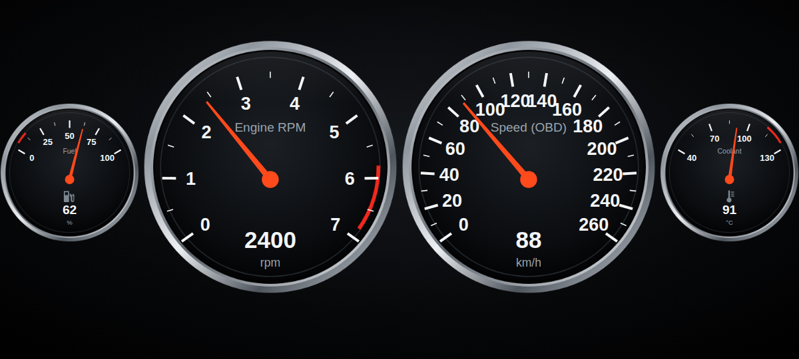

# Charger 06: Torque Pro themes

Themes for the **Torque Pro** app (themes don't work in Torque Lite), modelled on the real
2006 Dodge Charger cluster: chrome rings, gauge sweep angles taken from the factory dials, red
marks at E and H. Torque keeps doing the connection to your Wi-Fi ELM327. A theme only changes
how the gauges look.

| Theme | Look | Download |
|---|---|---|
| **Charger 06 OEM** | Satin-silver faces, black markings, red needles, like the factory cluster | [charger06oem.zip](https://github.com/hk-cpu/charger-cluster/raw/claude/phone-screen-mirror-dashboard-0n195w/torque-theme/dist/charger06oem.zip) |
| **Charger 06 Night** | Same layout with dark faces and white markings, easier at night | [charger06night.zip](https://github.com/hk-cpu/charger-cluster/raw/claude/phone-screen-mirror-dashboard-0n195w/torque-theme/dist/charger06night.zip) |

The preview is a mock-up. Torque draws its own numbers, ticks and needle on top of these faces,
so the real result looks slightly different.

## Install

1. On the Samsung, tap a **Download** link above. The zip saves to your **Downloads** folder.
2. Open **Torque Pro** → **⚙ Settings** → **Themes** (the theme chooser).
3. Tap **Import theme** and pick the zip from Downloads.
4. Select **Charger 06 OEM** (or **Night**). If it doesn't change straight away, close Torque fully and reopen it.

You can import both and switch between them for day and night.

## Set up the gauges like the factory cluster

In **Realtime Information**, long-press empty space → **Add display** → **Dial**, or long-press a
gauge → **Edit**. Left to right, like the real cluster:

| Position | Sensor | Min | Max | Size |
|---|---|---|---|---|
| 1 | Fuel Level (from engine ECU) | 0 | 100 % | small |
| 2 | Speed (OBD) | 0 | 260 km/h | large |
| 3 | Engine RPM | 0 | 7000 | large |
| 4 | Engine Coolant Temperature | 40 | 130 °C | small |

The red marks at E and H are drawn into the images, so they only line up with these ranges.
Some 2006 Chargers don't report fuel level over OBD. If the fuel gauge stays empty, that's the car, not the theme.

## What's in each zip

| File | What it is |
|---|---|
| `dial_background.png` | Chrome ring + face for speed, RPM and any other round gauge |
| `dial_background_05.png` | Coolant face, red mark near H, temperature icon |
| `dial_background_2f.png` | Fuel face, red mark near E, pump icon |
| `display_background.png` | Square digital displays, styled like the factory info screen |
| `background.jpg` | Dark dashboard background |
| `properties.txt` | Colours, sweep angles (big dials ±112°, small dials ±50°), font |

## Tweaking

`properties.txt` is plain text. Edit it, zip the files again (files at the top level of the zip,
no folder), and re-import. Useful settings:
- `globalDialStartAngle` / `globalDialStopAngle`: how far around the big gauges sweep (68 matches the factory dials).
- `dialNeedleColour`, `displayTickColour`, `displayTextValueColour`: colours (`#rrggbb`).
- `globalFontScale`: bigger or smaller numbers.
- `dialTickInnerRadius` / `dialTickOuterRadius`: move the tick marks in or out if they overlap the chrome ring.

## Rebuilding

`src/build.js` draws every image from code and writes both theme folders and zips:
`cd src && npm i playwright && node build.js`.
